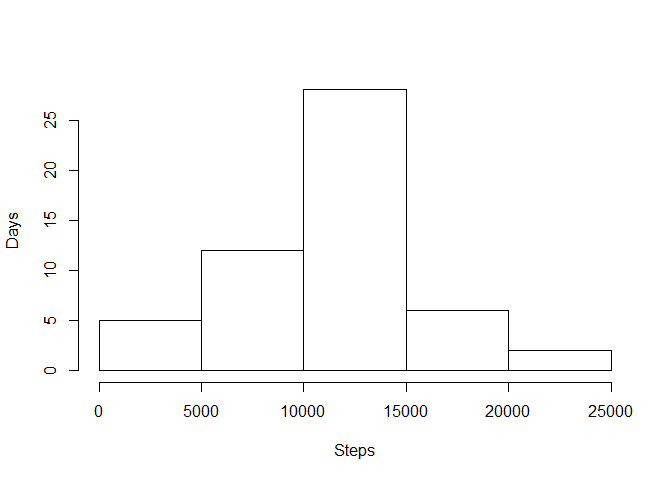
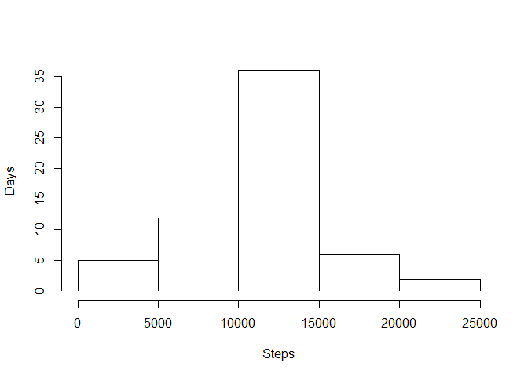
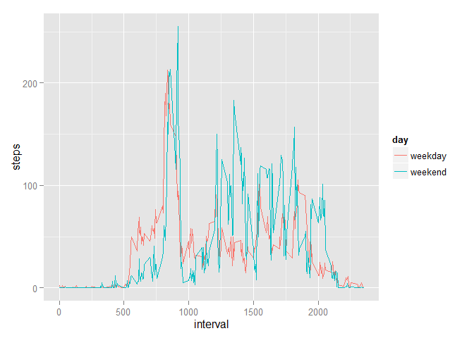

# Reproducible Research: Peer Assessment 1


## Loading and preprocessing the data

```r
library(ggplot2)

activity <- read.csv("input/activity.csv")
activity <- transform(activity, date = as.Date(date, "%Y-%m-%d", tz = "GMT")) 
head(activity)
```

```
##   steps       date interval
## 1    NA 2012-10-01        0
## 2    NA 2012-10-01        5
## 3    NA 2012-10-01       10
## 4    NA 2012-10-01       15
## 5    NA 2012-10-01       20
## 6    NA 2012-10-01       25
```


## What is mean total number of steps taken per day?

```r
activity_date <- aggregate(steps ~ date, activity, sum, na.action=na.exclude)
hist(activity_date$steps, xlab="Steps", ylab="Days", main="")
```

 

```r
summary(activity_date$steps)
```

```
##    Min. 1st Qu.  Median    Mean 3rd Qu.    Max. 
##      41    8841   10760   10770   13290   21190
```


## What is the average daily activity pattern?

```r
activity_interval <- aggregate(steps ~ interval, activity, mean, na.action=na.exclude)
plot(activity_interval$interval, activity_interval$steps, type="l", xlab="Interval", ylab="Steps")
```

 

```r
activity_interval$interval[activity_interval$steps == max(activity_interval$steps)]
```

```
## [1] 835
```

## Imputing missing values

```r
activity_no_na <- activity
```

Replacing NA valus with the mean value for that 5-minute interval.

```r
activity_no_na$steps <- ifelse(is.na(activity_no_na$steps), 
       activity_interval$steps[match(activity_interval$interval, activity_no_na$interval)], 
       activity_no_na$steps)
```


```r
activity_no_na_date <- aggregate(steps ~ date, activity_no_na, sum, na.action=na.pass)
hist(activity_no_na_date$steps, xlab="Steps", ylab="Days", main="")
```

 

```r
summary(activity_no_na_date$steps)
```

```
##    Min. 1st Qu.  Median    Mean 3rd Qu.    Max. 
##      41    9819   10770   10770   12810   21190
```

## Are there differences in activity patterns between weekdays and weekends?

```r
activity_no_na$day <- as.factor(ifelse(weekdays(activity_no_na$date) %in% c("Saturday", " Sunday"), "weekend", "weekday"))
activity_no_na_day_interval <- aggregate(steps ~ day + interval, activity_no_na, mean, na.action=na.exclude)
ggplot(activity_no_na_day_interval, aes(interval, steps, colour=day)) + geom_line()
```

 
